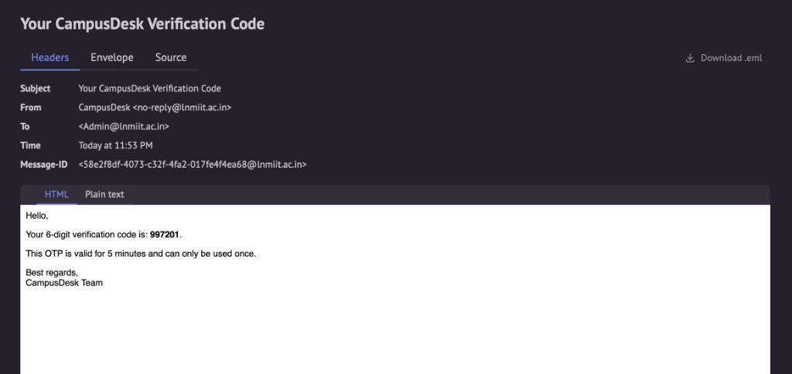

# CampusDesk

The application is built using a Node.js/Express backend with SQLite (`sqlite3`) for persistent storage, and a HTML/JS/CSS frontend.

---

## How to Download and Run Locally

Since cloud platforms like Render block outbound email ports by default on their free tier, **we have to run it locally** (specifically the Ethereal OTP verification).

### Step 1: Clone the Repository
Download the project to your local machine:
```bash
git clone https://github.com/Devansh2401/campusdesk.git
cd campusdesk
```

### Step 2: Install Server Dependencies
Navigate into the `server/` subfolder and install the required npm packages:
```bash
cd server
npm install
```

### Step 3: Configure Environment Variables & JWT Secret
Inside the `server/` directory, create a `.env` file from the example template:
```bash
cp .env.example .env
```
Open the newly created `server/.env` file in your text editor and make sure your `JWT_SECRET` key is specified. The file should contain:
```env
PORT=5000
JWT_SECRET=campusdesk_super_secret_key_67890
```
*(You can replace `campusdesk_super_secret_key_67890` with any custom JWT key string you want to use for signing sessions).*

### Step 4: Seed the Database
While still inside the `server/` directory, initialize the SQLite database schema and seed the default resource categories and the administrator account:
```bash
npm run seed
```
*(This will generate the local database file `server/campusdesk.db`)*

### Step 5: Run the Application
Start the Node.js Express server by running the start command **inside the `server/` directory**:
```bash
cd server
npm start
```
*(If you are already inside the `server/` folder just run `npm start` directly).*

Once the server is running, open **http://localhost:5000** in your browser.

---

## Evaluating Logins (Ethereal OTP)

The application implements passwordless verification via One-Time Passwords (OTPs) sent to official campus emails.

### 1. Administrator Account
* **Email**: `admin@lnmiit.ac.in`
* Enter the email on the login page and click **Send Verification Code**.
* Clicking the **Open Ethereal Mailbox** link that appears in the success banner will open the Ethereal inbox in a new tab.
* The inbox contains the dynamically dispatched verification email containing your OTP code, formatted as follows:



* Copy the 6-digit OTP code and enter it to log in as the Administrator.

### 2. Student Accounts
* Sign up using any other email ending in `@lnmiit.ac.in` (e.g. `student@lnmiit.ac.in`).
* Access the verification code via the Ethereal mailbox link in the same manner.
* Logging in automatically registers the new student profile in the database.
